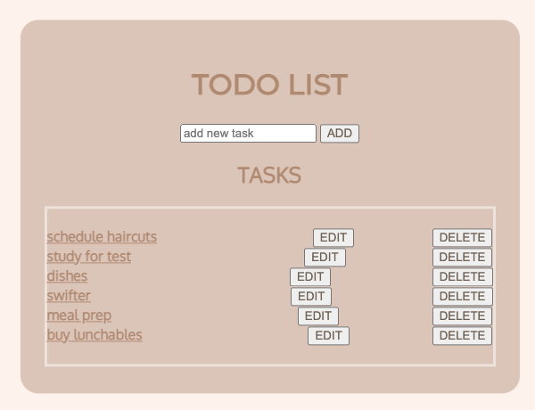
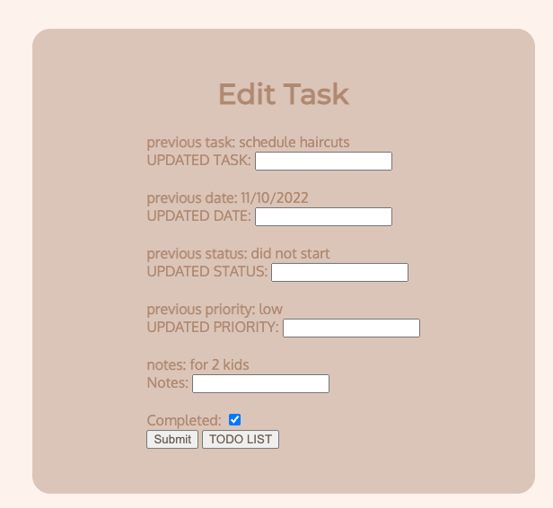

# Pendulum ToDo List App

I decided to create a todo list app because I love using them! I've tried Asana, Notion, Click-up, the notes app on my iphone and even Jira. Since I enjoy using them, I thought it was be interesting to actually try to make my own. There are a ton of things that could be improved on but it's fun to see how much work is put into making the smallest features. 

In this project, the technologies I used were:
- CSS
- HTML
- Javascript
- MongoDB / Mongoose
- Trello
- Heroku

[view app here](https://pendulum-project.herokuapp.com/pendulum)

[view roadmap here](https://trello.com/b/pdR6tBLX/pendulum)

I think this would be a fun personal project that I can continue iterating on. In the near future, I'd like to implement: 
- Add a calendar
- Automate tasks
- Basic authorization: restricting access to certain features, such as editing and deleting a resource, to an authenticated user, or the user that created that resource
- Consume a third-party API
- Send alerts